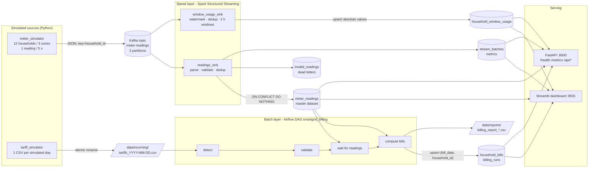

# Architecture notes (input for the EC8203 report)

Use case: **Use Case 3 - Smart Grid Energy Monitoring & Billing** (EC8203 Applied Big Data
Engineering mini-project brief).

Business question: *What is the current grid load and renewable contribution by zone, and what
will each household's bill look like once daily tariff data is applied to their consumption?*

## 1. Architecture decision: Lambda (Kappa rejected)

**Why Lambda fits this use case**

| Requirement | Implication |
|---|---|
| Live zone load / solar mix (seconds of latency) | Needs a streaming speed layer. Approximate is acceptable. |
| Bills are financial records: must be complete, exact, auditable, re-computable | Needs an authoritative batch computation over the complete day, re-runnable on demand. |
| Tariffs arrive **once per day as a file**, not as a stream | A scheduled/file-triggered batch job is the natural consumer; Airflow gives retries, audit and a UI. |
| Late or corrected data (late meter uploads, corrected tariff file) | Batch layer recomputes from the master dataset (`meter_readings`), so re-running fixes bills; the speed layer's watermark would silently drop very late data. |

The speed layer (Spark windows) and batch layer (Airflow over the raw master table) compute the
same daily kWh in two ways; the billing job logs and stores their difference
(`billing_runs.speed_layer_max_diff_kwh`) as a reconciliation metric.

**Rejected alternative: Kappa.** A Kappa design would compute bills inside the stream by joining
readings with the tariff file as a slowly-changing stream/table. It was rejected because (1) the
bill must wait for a *complete* day, which in a stream means a long watermark (holding state and
delaying the live view) or emitting provisional bills that are later retracted; (2) corrections
would require replaying Kafka from the start of the day (Kafka retention becomes the system of
record); and (3) the daily file source and the need for an operator-visible, re-runnable billing
job map naturally onto Airflow. The cost of Lambda - two code paths - is kept small here because
both layers share the same Python package (`smartgrid/`) and the batch layer reads the rows the
speed layer already validated and de-duplicated.

## 2. Technology choices

| Layer | Choice | Why for this scenario |
|---|---|---|
| Ingestion | Kafka 3.8 (KRaft, 1 broker, 3 partitions) | Durable replayable log (enables Spark recovery and the replay test); keying by household_id keeps each meter's readings ordered, which the billing readiness check relies on. |
| Stream processing | Spark 3.5 Structured Streaming | Event-time windows + watermarks, checkpointed state and Kafka offsets, `foreachBatch` for idempotent upserts. |
| Orchestration | Airflow 2.10 (LocalExecutor) | File-driven daily batch with sensor, retries, audit trail and manual re-trigger with conf. |
| Storage/serving | PostgreSQL 16 | Small data volume (~2.4 readings/s); transactional upserts (`ON CONFLICT`) give idempotency; SQL views serve the dashboard; one store keeps the demo light. |
| Dashboard | Streamlit 1.39 | Python-only, auto-refresh via `st.fragment(run_every=...)`. |
| Metrics API | FastAPI | `/health` (alert rules, 503 on critical) and Prometheus-format `/metrics`. |

## 3. Correctness properties

* **Dedup key**: `event_id = uuid5(household_id | event_time)` - deterministic, so re-sends carry the same id.
* **Raw sink**: in-batch `dropDuplicates(event_id)` + `INSERT ... ON CONFLICT (event_id) DO NOTHING`; readings, dead letters and batch metrics committed in one transaction.
* **Window sink**: `withWatermark(60 min).dropDuplicates([event_id, event_time])` then 2-hour tumbling windows, output mode `update`, upserting *absolute* values. Re-executing a micro-batch after a crash rewrites the same values.
* **Checkpoints**: Kafka offsets + aggregation state per query in the `spark-checkpoints` volume.
* **Billing**: consumption recomputed from `meter_readings`; bills + processed-file marker + audit row in one transaction; upsert on `(bill_date, household_id)`.
* **Event time everywhere**: windows, daily totals and billing days all use `event_time` (simulated clock, UTC), never `generated_at` or ingestion time.

## 4. Observability design

| Signal | Where | Why |
|---|---|---|
| JSON-lines logs (`ts, level, service, event, ...`) | every service (`docker compose logs`) | Correlate a problem across stages; per-batch counts in Spark logs. |
| `stream_batches` table | Spark, per micro-batch | Throughput, invalid rows, duplicates skipped, batch duration, max event time. |
| `invalid_readings` dead letters with `error_reason` | Spark | Diagnose bad producers without losing data. |
| `billing_runs` audit table | Airflow | Last job result, households billed, reconciliation diff, failure messages. |
| Alert rules (`smartgrid/alerts.py`) | dashboard + `/health` + `/metrics` | stale data (> 30 s), invalid rate (> 5 %), low renewable share (< 10 % in daylight), billing failure. |
